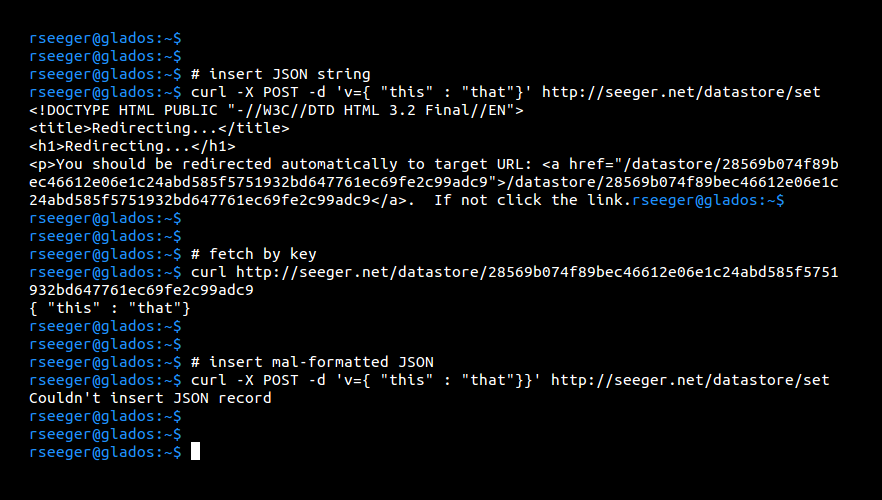

# json_store
Stores a JSON object as an HTTP reference to it's hash

## API

### `GET /datastore/<key>`

Read a value from the datastore by key. Returns an empty string if key doesn't exist.

### `POST /datastore/set`

Insert JSON value into the database. Key is derived as SHA-256(value). Parameters:

> **v** : The value to insert into the key/value store. Must be valid JSON.

## Running a datastore server

### Dependencies

> `$ sudo pip install flask`

### Run json_store service

## Using the datastore API

### Dependencies

> `$ sudo apt-get install curl`

### Connect to json_store service

